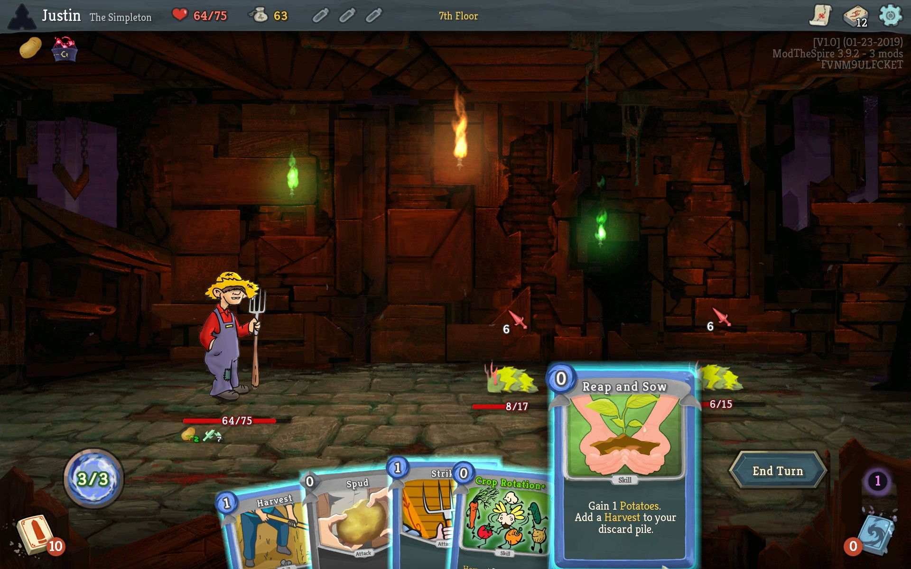

# Slay the Spire Mod: The Hayseed

Adds a new character, **The Hayseed**, to the [Slay the Spire]("https://store.steampowered.com/app/646570/Slay_the_Spire/") strategy game.

## Introduction
He got lost in a corn maze. Now he's wandering the spire and trying to find a way to hitch a ride home.

## Character Mechanics
Plant **Crops** and grow them to maturity. Then harvest them for a variety of effects.

**Seasons** change from run to run, changing which Crop power cards are available for added variety and replayability.

Over 70 new cards, plus many custom relics, potions, curses, events, and keywords to play with! With configurable cross-character support.

Translation support for Russian and Chinese. Support for the "Googly Eyes" mod.
***
On Steam Workshop: https://steamcommunity.com/sharedfiles/filedetails/?id=1717515299