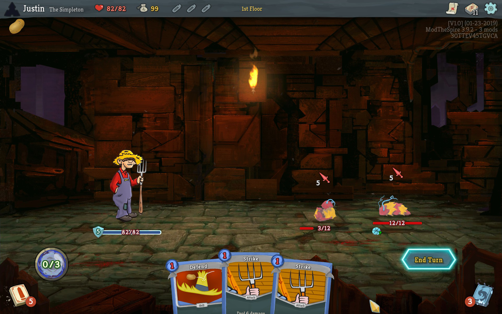

# Slay the Spire Mod - The Simpleton

Adds a new character "The Simpleton" to Slay the Spire game.

## Introduction
He got lost in a corn maze. Now he's lost in the spire and trying to way to hitch a ride home.
This is a simple mod for me to learn modding Slay the Spire.
The Simpleton offers N new cards, M new character-specific relics, and P new potions.

## Character Mechanics
### Hick with a Stick
Uses his pitchfork to poke enemies ... and scoop hay.
### Bib Overalls
His overalls and straw hat protect for the bugs, slime, and cosmic rays.

## Known Issues
- The Simpleton is under development.
